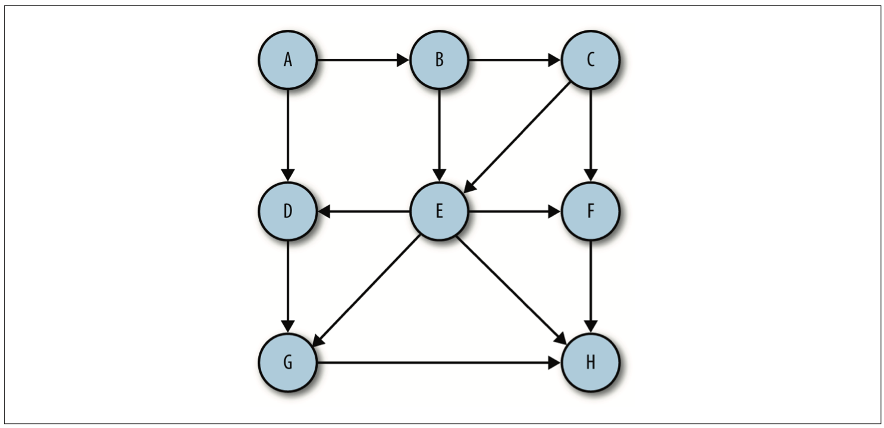
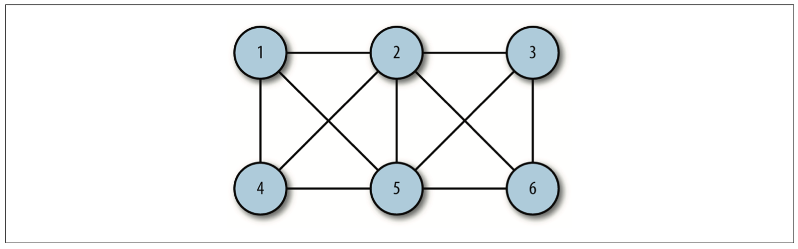

## 图

图是网络结构的抽象模型，图是一种复杂的非线性结构，图是一组由**线**的集合和**节点**的集合组成, 任何二元关系都可以用图来表示。

- 相邻顶点：由一条边连接在一起的顶点。
- 度: 如果 A 和其它三个顶点相连接，那么 A 的度为3
- 环: 如果 A 节点通过其它节点后又回到 A 节点，那么就形成一个环路径。
- 连通：如果每两个顶点间都存在路径，则表示该图是连通的。


有向图的边会有一个方向。



如果一条边存在两个方向则，是强连通的。


无序图，如果线的方向是无向，则称为无序图



如果为图的边加上权，则图是加权的。


### 邻接矩阵

通过会有一个二维矩阵，表示竖横坐标，数值 1 表示边。

### 邻接表

邻接表由图里面每一个顶点相邻的顶点列表组成，

#### 手动实现图

```js
// 图的顶点
function Vertext(label) {
  this.label = label
}

// 添加边
function addEdge(v, w) {
  this.adj[v].push(w)
  this.adj[w].push(v)
  this.edges++
}

// 显示图
function showGraph() {
  for (var i = 0; i < this.vertices; ++i) {
    console.log(i + ' -> ')
    for (var j = 0; j < this.vertices; ++j) {
      if (this.adj[i][j] !== undefined) {
        console.log(this.adj[i][j] + ' ')
      }
    }
  }
}

// 构建图
function Graph(v) {
  this.vertices = v
  this.edges = 0
  this.adj = [] // 二维数组保存每个顶点的连接边
  for (var i = 0; i < this.vertices; ++i) {
    this.adj[i] = []
    this.adj[i].push('')
  }
  this.addEdge = addEdge
  this.showGraph = showGraph
}

var g = new Graph(5) // 构建5个节点的图
g.addEdge(0, 1) // 添加边
g.addEdge(0, 2)
g.addEdge(1, 3)
g.addEdge(2, 4)
g.showGraph()

```

### 搜索图

1. 深度优先搜索

深度优先搜索从一条路径，查找到最深最后一个顶点，然后回溯，再查找下一条路径。

```js
function Graph(v) {
  this.vertices = v
  this.edges = 0
  this.adj = []
  for (var i = 0; i < this.vertices; ++i) {
    this.adj[i] = []
    this.adj[i].push('')
  }
  this.addEdge = addEdge
  this.showGraph = showGraph
  this.dfs = dfs
  this.marked = [] // 添加已遍历数组
  for (var i = 0; i < this.vertices; ++i) {
    this.marked[i] = false // 还没遍历过的全部设为默认值 false
  }
}

// 尝试优先算法
function dfs(v) {
  this.marked[v] = true
  if (this.adj[v] != undefined) {
    console.log('Visited vertex:' + v)
  }
  for(var i = 0; i < this.adj[v].length; i++) {
    if (!this.marked[this.adj[v][j]]) {
      this.dfs(this.adj[v][j])
    }
  }
}
```

2. 广度优先

广度优先搜索会首先从第一个顶点开始搜索，尝试访问尽可能广再深点。

```js
function bfs(s) {
  var queue = []
  this.marked[s] = true
  queue.push(s)
  while (queue.length > 0) {
    var v = queue.shift()
    if (v == undefined) {
      console.log('Visisted vertex:'  + v)
    }
    for (var i = 0; i < this.adj[v].length; i++) {
      if (!this.marked[this.adj[v][i]]) {
        this.edgeTo[w] = v
        this.marked[w] = true
        queue.push()
      }
    }
  }
}
```