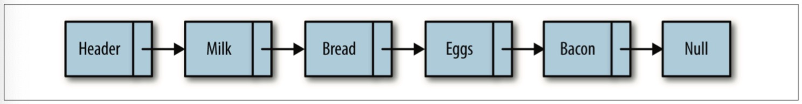
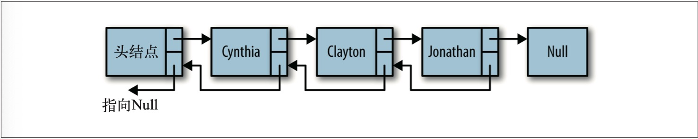

## 链表

缓存淘汰策略，常见的有三种：
1. FIFO (First In, First Out)
2. 最少使用策略LFU(Least Frequently Used)
3. 最近最少使用策略LRU(Least Recently Used)

数组，需要一块连续的内存空间来存储，对内存的要求比较高。
链表，并不需要一块连续的内存空间，它通过“指针”将一组零散的内存块串联起来使用。




链表是是由一级节点组成的集合，每个节点都使用一个对象的引用指向后一个对象。链表头部有 一个特殊的节点叫**头节点**(Header)表示一个表的头部，而尾部节点会指向一个 `null` 节点。


顺序快速访问可以使用链表，随机访问数组还是最好的选择, 因为如果查找链表第k位的时候，需要一个一个地往下数，需要**O(n)**时间复杂度，而数组只需要根据内存地址计算对应内存地址就行，而如果从数组的起点或中间插入或移除项的成本很高，因为需要移动元素，而链表则不需要，只需要考虑相邻的结点指针改变即可，所以对应的时间复杂度是**O(1)**,而数组的时间复杂度是 **O(n)**。

### 手动实现链表

```js
// 创建节点
function Node(element) {
  this.element = element
  this.next = null
}

// 实现 LinkedList 的类
function LList() {
  this.head = new Node('head')
  this.find = find
  this.insert = insert
  this.remove = remove
  this.display = display
}

// 查找元素
function find(item) {
  var currNode = this.head
  while(currNode.element != item) {
    currNode = currNode.next
  }
  return currNode
}

// 插入元素到链表
function insert(newElement, item) {
  var newNode = new Node(newElement)
  var current = this.find(item)
  newNode.next = current.next
  current.next = newNode
}

// 显示全部链表内容
function display() {
  var currNode = this.head
  while(currNode.next !== null) {
    console.log(currNode.next.element)
    currNode = currNode.next
  }
}

// 找节点的前一个节点
function findPrevious(item) {
  var currNode = this.head
  while(currNode.next !== null && currNode.next.element !== item) {
    currNode = currNode.next
  }
  return currNode
}

// 删除节点
function remove(item) {
  var prevNode = this.findPrevious(item)
  if  (prevNode.next !== null){
    prevNode.next = prevNode.next.next
  }
}

```

**DEMO**
通过上面搭建的模型可以实现一下
```js
var cities = new LList()
cities.insert('Conway','head')
cities.insert('Russellville', 'Conway')
cities.insert('Carlisle', 'Russellville')
cities.insert('Alma', 'Carlisle')
cities.display()
console.remove('Carlisle')
cities.display()
```

### ES6 实现链表

```js
class Node {
  constructor(element) {
    this.element = element
    this.next = undefined
  }

  toString() {
    return `${this.key}`
  }
}

class LinkedList {
  constructor() {
    this.count = 0
    this.head = undefined
    this.equealsFn = (a, b) {
      return a === b
    }
  }

  // 添加节点
  push(element) {
    const node = new Node(element)
    let current
    if (this.head == null) {
      this.head = node
    } else {
      current = this.head
      while (current.next != null) { // 遍历 current.next 下一个节点为空的时候添加节点
        current = current.next
      }
      current.next = node
    }
    this.count++
  }

  // 删除在索引位置的节点
  removeAt(index) {
    // 检查越界
    if (index >= 0 && index < this.count) {
      let current = this.head
      if (index === 0) {
        this.head = current.next
      } else {
        let previous
        for (let i = 0; i < index; i++) {
          previous = current
          current = current.next
        } // 找到需要替换的位置
        previous.next = current.next // 前节点的下一个节点的引用等于当前节点的下一个引用
      }
      this.count-- // 减少整个链表的数量
      return current.element
    }
    return undefined
  }

  // 获取索引位置的节点
  getElementAt (index) {
    if (index >= 0 && index <= this.count) {
      let node = this.head
      for (let i = 0; i < index && node != null; i++) {
        node = node.next
      }
      return node
    }
    return undefined
  }

  // 返回一个元素的位置
  indexOf (element) {
    let current = this.head // 从 head 开始遍历
    for (let i = 0; i < this.count && current != null; i++) {
      if (this.equalsFn(element, current.element)) { // 当遍历的元素等于 element 的时候返回索引
        return i
      }
      current = current.next
    }
    return -1 // 如果没有返回索引
  }

  // 返回当前链表的大小 Size
  size() {
    return this.count
  }

  // 判断链表是否为空
  isEmpty () {
    return this.size() === 0
  }

  // 返回头部节点
  getHead() {
    return this.head
  }

  toString() {
    if (this.head == null) {
      return ''
    }
    let objString = `$(this.head.element)`
    let current = this.head.next
    for (let i = 1; i < this.size() && current != null; i++) {
      objString = `${objString}, ${current.element}` // 叠加链表全部的节点
      current = current.next
    }
    return objString
  }
}
```

### 双向链表

双向链表是链表里面的节点除了，每个Node携带向后指向的索引，还会另外的一个属性携带向前指向。双链表在某些情况下的插入、删除等操作都要比单链表简单高效。双向链表需要更多的内存保存前置指针，但运算更快，是以空间换时间的思想。

- 空间换时间
- 时间换空间



实现双向链表
```js
function Node(element) {
  this.element = element
  this.next = null
  this.previous = null
}

function LList() {
  this.head = new Node('head')
  this.find = find
  this.insert = insert
  this.display = display
  this.remove = remove
  this.findLast = findLast
  this.disReverse = dispReverse
}

// 从尾节点开始显示每个节点
function dispReverse() {
  var currNode = this.head
  currNode = this.findLast()
  while(currNode.previous !== null) {
    console.log(currNode.element)
    currNode = currNode.previous
  }
}

// 查找最后一个节点
function findLast() {
  var currNode = this.head
  while(currNode.next !== null) {
    currNode = currNode.next
  }
  return currNode
}

function remove(item){
  var currNode = this.find(item)
  if (currNode.next !== null) {
    currNode.previous.next = currNode.next
    currNode.next.previous = currNode.previous
    currNode.next = null
    currNode.previous = null
  }
}

// 不再需要 findPrevious 函数
// function findPrevious(item)
function display() {
  var currNode = this.head
  while(currNode.next !== null) {
    console.log(currNode.next.element)
    currNode = currNode.next
  }
}

function find(item) {
  var currNode = this.head
  while(currNode.element !== item) {
    currNode = currNode.next
  }
  return currNode
}

function insert(newElement, item) {
  var newNode = new Node(newElement)
  var current = this.find(item)
  newNode.next = current.next
  newNode.previous = current
  current.next = newNode
}
```

ES6 实现

```js
// 定义双向链表的节点
class DoublyNode extends Node {
  constructor(element, next, prev) {
    super(element, next)
    this.prev = prev
  }
}

// 字义双向链表
class DoublyLinkedList extends LinkedList {
  constructor(equalsFn = defaultEquals) {
    super(equalsFn)
    this.tail = undefined // 定义尾部节点
  }
  // 在搜索位置插入新 element
  insert(element, index) {
    if (index >= 0 && index <= this.count) {
      const node = new DoublyNode(element)
      let current = this.head
      if (index === 0) { // 如果插入在头部
        if (this.head == null) {
          this.head = node
          this.tail = node
        } else { // 替换掉当前 head
          node.next = this.head
          current.prev = node
          this.head = node
        }
      } else if (index === this.count) { // 插入在尾部
        current = this.tail
        current.next = node
        node.prev = current
        this.tail = node
      } else {
        const previous = this.getElementAt(index - 1) // 获取前节点
        current = previous.next // 获取当前节点
        node.next = current // 插入到当前节点的位置
        previous.next = node
        current.prev = node
        node.prev = previous
      }
      this.count++
      return true
    }
    return false
  }

  // 删除索引节点
  removeAt(index) {
    if (index >= 0 && index < this.count) {
      let current = this.head
      if (index === 0) { // 头部
        this.head = current.next // 设置为下一个节点
        if (this.count === 1) {
          this.tail = undefined
        } else {
          this.head.prev = undefined // 把前节点设置为空
        }
      } else if (index === this.count - 1) {// 尾部
        current = this.tail 
        this.tail = current.prev // 把 tail 节点的前置节点变成新尾部
        this.tail.next = undefined // 下一个节点设置为空
      } else { // 其它情况
        current = this.getElementAt(index) // 找到当前搜索节点
        const previous = current.prev
        previous.next = current.next // 下个节点赋值给前节点的 next
        current.next.prev = previous // 下个节点的前索引也要连上
      }
      this.count--
      return current.element
    }
    return undefined
  }
}


```

### 循环链表

循环链表， 可以像链表一样只有单向引用，也可以像双向链表一样有双向引用。循环链表的最后一个元素指向下一个元素的指针(tail.next)，指向首部指点(head)，而不是像之前 `undefined` 表示界限。循环链表的优点是从链尾到链头比较方便，处理数据具有环形结构特点时，就特别适合采用循环链表。


```js
CircularLinkedList extends LinkedList {
  constructor(equalsFn = defaultEquals) {
    super(equalsFn)
  }

  insert(element, index) {
    if (index >= 0 && index <= this.count) {
      const node = new Node(element)
      let current = this.head
      if (index === 0) {
        if (this.head == null) {
          this.head = node
          node.next = this.head
        } else {
          node.next = current
          current = this.getElementAt(this.size()) // 找到最后一个节点
          this.head = node
          current.next = this.head // 最后一个节点的 next 指向 首部
        }
      } else {
        const previous = this.getElementAt(index - 1) // 找到当前索引的前一个节点
        node.next = previous.next
        previous.next = node // 插入到节点当中
      }
      this.count++
      return true
    }
    return false
  }

  removeAt(index) {
    if (index >= 0 && index < this.count) {
      let current = this.head
      if (index === 0) {
        if (this.size() === 1) {
          this.head = undefined
        } else {
          const removed = this.head
          current = this.getElementAt(this.size())
          this.head = this.head.next
          current.next = this.head
          current = removed
        }
      } else {
        const previous = this.getElementAt(index - 1)
        current = previous.next
        previous.next = current.next
      }
      this.count--
      return current.element
    }
    return undefined
  }
}
```

### 有序链表

有序链表是指保持元素有序的链表结构。除了使用排序算法之外，我们还可以将元素插入到正确的位置来保证链表的有序性。

```js
const Compare = {
  LESS_THAN: -1,
  BIGGER_THAN：1
}

function defaultCompare(a, b) {
  if (a === b) {
    return 0
  }
  return a < b ? Compare.LESS_THAN : Compare.BIGGER_THAN
}

class SortedLinkedList extends LinkedList {
  constructor(equalsFn = defaultEquals, compareFn = defaultCompare) {
    this.compareFn = compareFn
  }

  insert(element, index = 0) {
    if (this.isEmpty()) {
      return super.insert(element, 0)
    }
    const pos = this.getIndexNextSortedElement(element) // 找到排序中的比上一个节点大比下一个节点小的索引
    return super.insert(element, pos) // 插入
  }

  getIndexNextSortedElement(element) {
    let current = this.head // 从头部开始查找
    for (let i = 0; i < this.size() && current; i++) {
      const comp = this.compareFn(element, current.element) // 如果传入节点比当前节点小，则返回当前的 Index
      if (comp === Compare.LESS_THAN) {
        return i
      }
      current = current.next
    }
    return i
  }
}
```

### StackLinkedList 类模拟其它数据结构

```js
class StackLinkedList {
  constructor() {
    this.items = new DoublyLinkedList() // 利用双向链表
  }
  push(element) {
    this.items.push(element)
  }
  pop() {
    if (this.isEmpty()) {
      return undefined
    }
    return this.items.removeAt(this.size() - 1)
  }
  peek() {
    if (this.isEmpty()) {
      return undefined
    }
    return this.items.getElementAt(this.size() - 1).element
  }
  isEmpty() {
    return this.items.isEmpty()
  }
  size() {
    return this.items.size()
  }
  clear() {
    return this.items.clear()
  }
  toString() {
    return this.items.toString()
  }
}
```

### 双向循环链表


