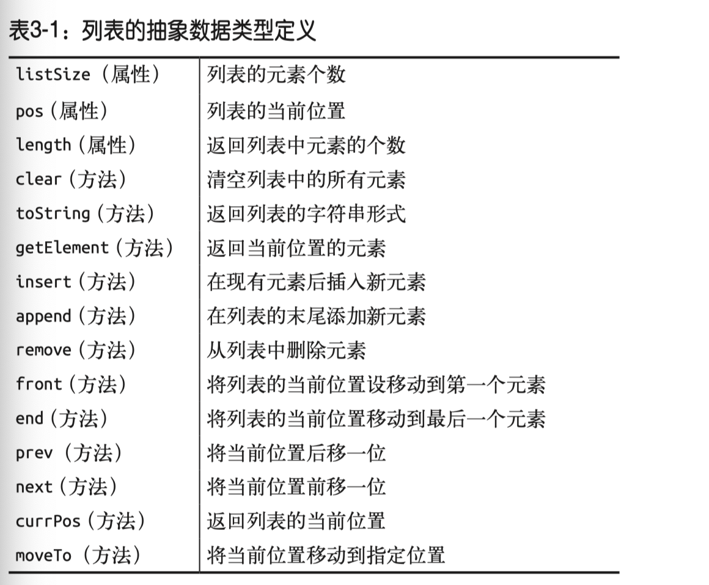

## 列表

列表主要是使用在保存元素不是太多的时候，当不需要在一个很长的序列中查找元素，或者对其进行排序时，列表显得非常重要，如果存在数据结构复杂列表作用就没这么大了。

列表是一个抽象的数据类型定义，JavaScript 里没有定义其的语法。
列表的定义是，列表是一组有序的数据，每个列表中的数据项被称为元素，列表中的元素可以是任意数据类型的，列表中可以保存多少元素并没有事前限定，实际使用元素的数量还是受到内存限制的。

列表其实和数组很像，但会封装了一些方法来操作列表访问列表个数：

- 列表个数用 `listSize` 变量表示。
- 列表末尾插入一个元素 `append`。
- 在给定元素位置 `insert` 一个元素。
- `clear` 方法可以清空列表中的所有元素。
- 列表有拥有表示当前元素位置属性`currPos`和操作方法，使用 `next()` 方法可以从当前元素移到下一个元素，`prev()` 可以向前移动一个元素， `movtTo(n)` 直接移动到指定位置。




### 列表的实现

```js
// 列表后面添加元素
function append(element) {
  this.dataStore[this.listSize++] = element
}

// 查找列表元素
function find(element) {
  for (var i = 0; i < this.dataStore.length; ++i) {
    if (this.dataStore[i] == element) {
      return i
    }
  }
  return -1
}

// 从列表中删除元素
function remove(element) {
  var foundAt = this.find(element)
  if (founAt > -1) {
    this.dataStore.splice(foundAt, 1)
    --this.listSize
    return true
  }
  return false
}

// 查询当前列表有多少个元素
function length() {
  return this.listSize
}

// 显示列表中的元素
function toString() {
  return this.dataStore
}

// 向列表中插入一个元素
function insert(element, after) {
  var inserPos = this.find(afer)
  if (insertPos > -1) {
    this.dataStore.splice(insertPos + 1, 0 , element)
    ++this.listSize
    return true
  }
  return false
}

// 清空列表中的所有元素
function clear() {
  delete this.dataStore
  this.dataStore = []
  this.listSize = this.pos = 0
}

// 判断给定值是否在列表中
function contains(element) {
  for(var i = 0; i < this.dataStore.length; ++i) {
    if (this.dataStore[i] == element) {
      return true
    }
  }
  return false
}

// 遍历列表的方法
function front() {
  this.pos = 0
}

function end() {
  this.pos = this.listSize-1
}

function prev() {
  if (this.pos > 0) {
    --this.pos
  }
}

function next() {
  if (this.pos < this.listSize -1) {
    ++this.pos
  }
}

function currPos() {
  return this.pos
}

function moveTo(position) {
  this.pos = position
}

function getElement() {
  return this.dataStore[this.pos]
}

function List() {
  this.listSize = 0 // 保存列表总元素
  this.pos = 0 // 列表当前元素位置
  this.dataStore = [] // 保存列表元素的地方
  this.clear = clear
  this.find = find
  this.toString = toString
  this.insert = insert
  this.append = append
  this.remove = remove
  this.front = front
  this.end = end
  this.prev = prev
  this.next = next
  this.length = length
  this.currPos = currPos
  this.moveTo = moveTo
  this.getElement = getElement
  this.length = length
  this.contains = contains
}
```

