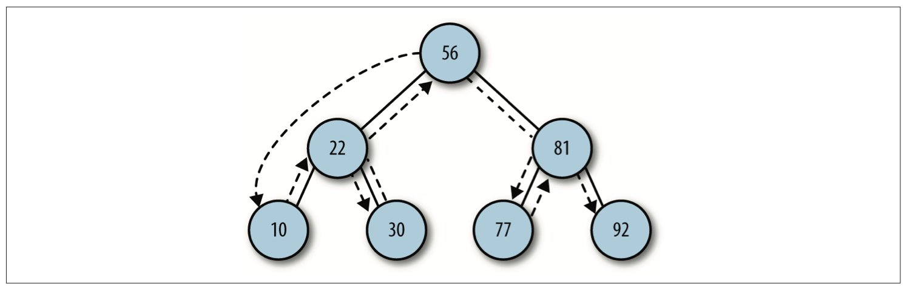

## 树

树是计算机科学家中经常用到的数据结构。树是一种非线性的数据结构，以分层的方式来存储数据，树还滓用来存储有序列表。选择树而不是其它数据结构，是因为在二叉树上查找会非常快。添加删除元素也非常快。

树由一组以边连接的节点组成，根节点是最顶层。


### 二叉树

二叉树是一种特殊的树，它的子节点个数不超过两个。在二叉树里面一个父节点下面会有两个节点，**左节点**和**右节点**。

#### 二叉查找树
在二叉查找树里面，通常会把较少的值放在左边，大的值放在右边。

#### 实现二叉查找树

```js
// 显示数据
function show()  {
  return this.data
}
// 节点
function Node(data, left, right) {
  this.data = data
  this.left = left
  this.right = right
  this.show = show
}

// 添加节点，插入后会是一个左小右大的二叉顺序树
function insert(data) {
  var n = new Node(data, null, null)
  if (this.root == null) {
    this.root = n
  } else {
    var current = this.root
    var parent
    while(true) {
      parent = current // 当前父节点给 parent
      if (data < current.data) { // 如果比当前节点值小放左边
        current = current.left
        if (current == null)  { // 遍历到当前左节点为空，放入
          parent.left = n
          break
        }
      } else { //  比当前节点值大放右边
        current = current.right
        if (current == null) { // 遍历到 当前右节点为空，放入
          parent.right = n
          break
        }
      }
    }
  }
}

// 中序遍历
function inOrder(node) {
  if (!(node == null)) {
    inOrder(node.left)
    console.log(node.show() + '')
    inOrder(node.right)
  }
}

function BST() { // 建立二叉查找树模型
  this.root = null  // 表示根节点
  this.insert = insert // 插入节点函数
  this.inOrder = inOrder 
}
```
`inOrder()` 方法访问路径图



测试 `inOrder` 中序访问

```js
var nums = new BST()
nums.insert(23)
nums.insert(45)
nums.insert(16)
nums.insert(37)
nums.insert(3)
nums.insert(99)
nums.insert(22)
console.log('Inorder traversal: ')
inOrder(nums.root)
```

先序遍历：
```js
function preOrder(node) {
  if (!(node == null)) {
    console.log(node.show() + ' ')
    preOrder(node.left)
    preOrder(node.right)
  }
}
```