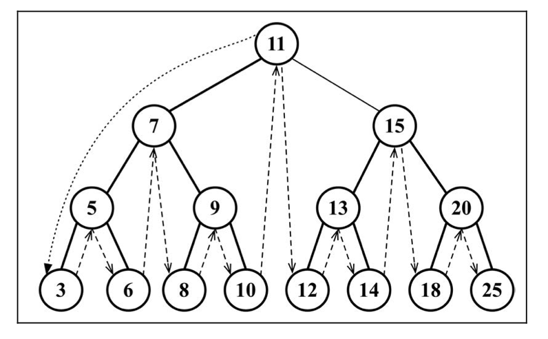

## 树

树是计算机科学家中经常用到的数据结构。树是一种非线性的数据结构，以分层的方式来存储数据，树还用来存储有序列表。选择树而不是其它数据结构，是因为在二叉树上查找会非常快。添加删除元素也非常快。

树由一组以边连接的节点组成，根节点是最顶层，每个节点都有一个父节点。

- 根节点，根节点没有父节点，根节点下面可以有一个或多个子节点。


### 二叉树

二叉树是一种特殊的树，它的子节点个数不超过两个。在二叉树里面一个父节点下面会有两个节点，**左节点**和**右节点**。

### 二叉查找树(BST)

二叉搜索树(BST)是二叉树的一种，但是左侧节点存储比父节点小的值，右节点存储比父节点大的值。

### 树的遍历(二叉查找树搜索, BinarySearchTree)

#### 中序遍历

中序遍历是以上行顺序访问 BST, 也是从最小到最大的顺序访问所有节点，中序遍历的一种应用就是对树进行排序操作。

```js
// 显示数据
function show()  {
  return this.data
}
// 节点
function Node(data, left, right) {
  this.data = data
  this.left = left
  this.right = right
  this.show = show
}

// 添加节点，插入后会是一个左小右大的二叉顺序树
function insert(data) {
  var n = new Node(data, null, null)
  if (this.root == null) {
    this.root = n
  } else {
    var current = this.root
    var parent
    while(true) {
      parent = current // 当前父节点给 parent
      if (data < current.data) { // 如果比当前节点值小放左边
        current = current.left
        if (current == null) { // 遍历到当前左节点为空，放入
          parent.left = n
          break
        }
      } else { //  比当前节点值大放右边
        current = current.right
        if (current == null) { // 遍历到 当前右节点为空，放入
          parent.right = n
          break
        }
      }
    }
  }
}

// 中序遍历
function inOrder(node) {
  if (node !== null) {
    inOrder(node.left)
    console.log(node.show() + '')
    inOrder(node.right)
  }
}

function BST() { // 建立二叉查找树模型
  this.root = null  // 表示根节点
  this.insert = insert // 插入节点函数
  this.inOrder = inOrder 
}
```

测试 `inOrder` 中序遍历

```js
var nums = new BST()
nums.insert(23)
nums.insert(45)
nums.insert(16)
nums.insert(37)
nums.insert(3)
nums.insert(99)
nums.insert(22)
console.log('Inorder traversal: ')
inOrder(nums.root) // 3 16 22 23 37 45 99
```

**inOrder** 中序遍历会从最小的左节点开始遍历


#### ES6 中序遍历

```js
inOrderTraverse(callback) {
  this.inOrderTraverseNode(this.root, callback)
}

inOrderTraverseNode(node, callback) {
  if (node != null) {
    this.inOrderTraverseNode(node.left, callback)
    callback(node.key)
    this.inOrderTraverseNode(node.right, callback)
  }
}
```



#### 先序遍历

先序遍历是以优先于遍历后代节点顺序访问每个节点的，先序遍历的一种应用是打印一个结构化的文档。

```js
function preOrder(node) {
  if (node !== null) {
    console.log(node.show() + ' ')
    preOrder(node.left)
    preOrder(node.right)
  }
}

var nums = new BST()
nums.insert(23)
nums.insert(45)
nums.insert(16)
nums.insert(37)
nums.insert(3)
nums.insert(99)
nums.insert(22)
console.log('Inorder traversal: ')
preOrder(nums.root) // 23 16 3 22 45 37 99
```

先序遍历, 会先从根节点遍历后再跟下最小值节点节排列。


#### ES6 先序遍历

```js
preOrderTraverse(callback) {
  this.preOrderTraverseNode(this.root, callback)
}

preOrderTraverseNode(node, callback) {
  if (node != null) {
    callback(node.key)
    this.preOrderTraverseNode(node.left, callback)
    this.preOrderTraverseNode(node.right, callback)
  }
}
```


#### 后序遍历

后序遍历是先访问节点的后代节点，再访问节点本身，后序遍历的一种应用场景是计算一个目录及其子目录中所有文件所占空间的大小。

```js
function postOrder(node) {
  if (node !== null) {
    postOrder(node.left)
    postOrder(node.right)
    console.log(node.show() + ' ')
  }
}
var nums = new BST()
nums.insert(23)
nums.insert(45)
nums.insert(16)
nums.insert(37)
nums.insert(3)
nums.insert(99)
nums.insert(22)
console.log('Inorder traversal: ')
postOrder(nums.root) // 3 22 16 37 99 45 23
```

后序遍历，从孙节点先把最小值和最大值遍历后，再遍历根节点。

下面是操作视意图：


#### ES6 后序遍历实现

```js
postOrderTraverse(callback) {
  this.postOrderTraverseNode(this.root, callback)
}

postOrderTraverseNode(node, callback) {
  if (node != null) {
    this.postOrderTraverseNode(node.left, callback)
    this.postOrderTraverseNode(node.right, callback)
    callback(node.key)
  }
}
```


### 搜索二叉树上的值

查找最小值

```js
function getMin() {
  var current = this.root
  while(current.left !== null) {
    current = current.left // 获取树节点最左孙节点的值
  }
  return current.data
}
```

ES6 实现

```js
min() {
  return this.minNode(this.root)
}

minNode(node) {
  let current = node
  while(current != null && current.left != null) {
    current = current.left
  }
  return current
}
```

查找最大值

```js
function getMax() {
  var current = this.root
  while(current.right !== null) {
    current = current.right // 获取树节点最右子孙节点的值
  }
  return current.data
}
```

ES6 实现
```js
max() {
  return this.maxNode(this.root)
}
maxNode(node) {
  let current = node
  while (current != null && current.right !=null) {
    current = current.right
  }
  return current
}
```

查找一个特定的值

```js
function find(data) {
  var current = this.root
  while(current !== null) {
    if (current.data == data) {
      return current
    } else if (data < current.data){
      current = current.left
    } else {
      current = current.right
    }
  }
  return null
}
```

ES6 实现

```js
search(key) {
  return this.searchNode(this.root, key)
}
searchNode(node, key) {
  if (node == null) {
    return false // 找不到返回 false
  }
  if (this.compareFn(key, node.key) === Compare.LESS_THAN) { // 二分查找法
    return this.searchNode(node.left, key)
  } else if (this.compareFn(key, node.key) === Compare.BIGGER_THAN) {
    return this.searchNode(node.right, key)
  } else {
    return true // 找到就返回 true
  }
}
```

### 二叉树上删除节点

```js
function remove(data) {
  root = removeNode(this.root, data)
}

function removeNode(node, data) {
  if (node == null) {
    return null
  }
  if (data == node.data) {
    if (node.left == null && node.right == null) {
      return null
    }
    if (node.left == null) {
      return node.right
    }
    if (node.right == null) {
      return node.left
    }
    var getSmallest = function(node) {
      if (node.left == null && node.right == null) {
        return node
      }
      if (node.left !== null) {
        return node.left
      }
      if (node.right !== null) {
        return getSmallest(node.right)
      }
    }
    var tempNode = getSmallest(node.right)
    node.data = tempNode.data
    node.right = removeNode(node.right, tempNode.data)
  } else if (data < node.data) {
    node.left = removeNode(node.left, data)
    return node
  } else {
    node.right = removeNode(node.right, data)
    return node
  }
}
```

ES6 删除节点实现

```js
removeNode(node, key) {
  if (node == null) {
    return null
  }
  if (this.compareFn(key, node.key) === Compare.LESS_THAN) { // 比当前值小，则交给左节点处理
    node.left = this.removeNode(node.left, key)
    return node
  } else if (this.compareFn(key, node.key) === Compare.BIGGER_THAN) { // 比当前值大，则交给右节点处理
    node.right = this.removeNode(node.right, key)
    return node
  } else {
    if (node.left == null && node.right == null) { // 节点没有左右节点则移除当前节点
      node = null
      return node
    }
    if (node.left == null) { // 节点没有左节点的情况
      node = node.right
      return node
    }
    if (node.right == null) { // 节点没有右节点的情况
      node = node.left
      return node
    }
    // 当节点有两个子节点的时候
    const aux = this.minNode(node.right) // 查该节点右边子树的最小节点
    node.key = aux.key // 替换为右边子树该节点的值
    node.right = this.removeNode(node.right, aux.key) // 再移除右边子树的最小节点
    return node // 返回节点
  }
}
```


### 二叉树计数的实现

```js
// 创建节点
function Node(data, left, right) {
  this.data = data
  this.count = 1 // count 用来统计
  this.left = left
  this.right = right
  this.show = show
}

// 更新统计数
function update(data) {
  var grade = this.find(data)
  grade.count++
  return grade
}

function prArray(arr) {
  console.log(arr[0].toString() + ' ')
  for (var i = 1; i < arr.length; ++i) {
    console.log(arr[i].toString() + ' ')
    if (i % 10 == 0) {
      console.log('\n')
    }
  }
}

function genArray(length) {
  var arr = []
  for (var i = 0; i < length; ++i) {
    arr[i] = Math.floor(Math.random() * 101)
  }
  return arr
}
```


### BinarySearchTree ES6 实现

```js
class Node {
  constructor(key) {
    this.key = key
    this.left = null
    this.right = null
  }
}

class BinarySearchTree {
  constructor(compareFn = defaultCompare) {
    this.compareFn = compareFn
    this.root = null
  }
  // 插入节点
  insertNode(node, key) {
    if (this.compareFn(key, node.key) === Compare.LESS_THAN) { // 判断新的值是不是比当前 节点 node 值小，如果是插入到左右，不是插入到右边
      if (node.left == null) { // 如果左节点不存在，放到左节点，已存在，放到左节点的下面
        node.left = new Node(key)
      } else {
        this.insertNode(node.left, key)
      }
    } else {
      if (node.right == null) {
        node.right = new Node(key)
      } else {
        this.inserNode(node.right, key)
      }
    }
  }
  // 插入
  insert(key) {
    if (this.root == null) {
      this.root = new Node(key)
    } else {
      this.insertNode(this.root, key)
    }
  }

}
```

### 自平衡树

在二叉树(BST)里面会存在一个问题，树的节点添加顺序会，影响你的树的结构，可能树的一边会非常的深。这会在添加，移除，搜索某个节点时引起一些性能问题，而自平衡二叉搜索树则没有这问题。

自平衡二叉树(Adelson-Velskii-Landi, AVL树)，意思是指树任何一个节点左右两侧子树的高度之差最多为1。

```js
const BalanceFactor = {
  UNBALANCED_RIGHT: 1,
  SLIGHTLY_UNBALANCED_RIGHT: 2,
  BALANCED: 3,
  SLIGHTLY_UNBALANCED_LEFT: 4,
  UNBALANCED_LEFT: 5
}
class AVLTree extends BinarySearchTree {
  constructor(compareFn = defaultCompare) {
    super(compareFn)
    this.compareFn = compareFn
    this.root = null
  }

  // 获取节点深度
  getNodeHeight(node) { 
    if (node == null) {
      return - 1
    }
    return Math.max(
      this.getNodeHeight(node.left),
      this.getNodeHeight(node.right)
    ) + 1
  }

  getBalanceFactor(node) { // 判断是否平衡，那里不平衡
    const heightDifference = this.getNodeHeight(node.left) - this.getNodeHeight(node.right)
    switch (heightDifference) {
      case -2:
        return BalanceFactor.UNBALANCED_RIGHT
      case -1:
        return BalanceFactor.SLIGHTLY_UNBALANCED_RIGHT
      case 1:
        return BalanceFactor.SLIGHTLY_UNBALANCED_LEFT
      case 2:
        return BalanceFactor.UNBALANCED_LEFT
      default:
        return BalanceFactor.BALANCED
    }
  }
}
```

### 平衡操作-AVL旋转

- 左-左(LL): 向右的单旋转
- 右-右(RR): 向左的单旋转
- 左-右(LR): 向右的双旋转(先LL旋转，再RR旋转)
- 右-左(RL): 向左的双旋转(先RR旋转，再LL旋转)

LL 向右的单旋转
```js
rotationLL(node) {
  const tmp = node.left // tmp 等于 X 节点
  node.left = tmp.right // X 的右节点放到 Y 的左节点
  tmp.right = node // Y 放到 X 的右节点
  return tmp // 返回 X 节点
}
```


RR 向左的单旋转
```js
rotationRR(node) {
  const tmp = node.right
  node.right = tmp.left
  tmp.left = node
  return tmp
}
```


LR 向右的双旋转
这种情况出现在左侧子节点的高度大于右侧子节点的高度，并且左侧子节点右侧较重。

```js
rotationLR(node) {
  node.left = this.rotationRR(node.left)
  return this.rotationLL(node)
}
```

RL 向左的双旋转
这种情况出现在右侧子节点的高度大于左侧子节点的高度，并且右侧子节点的左侧较重。

```js
rotationRL(node) {
  node.right = this.rotationLL(node.right)
  return this.rotationRR(node)
}
```

### AVL 插入节点

AVL树和普通二叉树的插入节点是有区别的

```js
insert(key) {
  this.root = this.insertNode(this.root, key)
}

insertNode(node, key) {
  if (node == null) { // 为空的时候创建节点
    return new Node(key)
  } else if (this.compareFn(key, node.key) === Compare.LESS_THAN) { // 如果存在节点，并比当前节点小则放到左节点下面插入
    node.left = this.insertNode(node.left, key)
  } else if (this.compareFn(key, node.key) === Compare.BIGGER_THAN) { // 如果存在节点，并比当前节点大则放到右节点下面的插入
    node.right = this.insertNode(node.right, key)
  } else { // 如果相等就直接返回当前 node
    return node
  }

  // 插入后需要，进行树平衡操作
  const balanceFactor = this.getBalanceFactor(node)
  if (balbanceFactor == BbalanceFactor.UNBALANCED_LEFT) {
    if (this.compareFn(key, node.left.key) === Compare.LESS_THAN) {
      node = this.rotationLL(node)
    } else {
      return this.rotationLR(node)
    }
  }
  if (balanceFactor ===  BalanceFactor.UNBALANCED_RIGHT) {
    if (this.compareFn(key, node.right.key) === Compare.BIGGER_THAN) {
      node = this.rotationRR(node)
    } else {
      return this.rotationRL(node)
    }
  }
  return node
}
```

### AVL 删除节点

AVL树的删除节点 和 BST(BinarySearchTree)树基本一样，但是要注册删除节点后树是否还平衡
```js
removeNode(node, key) {
  node = super.removeNode(node, key) // 调用 BST 的方法删除节点

  if (node == null) { // node节点为空时，直接返回
    return node
  }

  const balanceFactor = this.getBalanceFactor(node)
  if (balanceFactor === BalanceFactor.UNBALANCED_LEFT) {
    const balanceFactorLeft = this.getBalanceFactor(node.left)
    if (balanceFactor === BalanceFactor.BALANCED || balanceFactorLeft === BalanceFactor.SLIGHTLY_UNBALANCED_LEFT) {
      return this.rotationLL(node)
    }
    if (balanceFactorLeft === BalanceFactor.SLIGHTYLY_UNBALANCED_RIGHT) {
      return this.rotationLR(node.left)
    }
  }
  if (balanceFactor === BalanceFactor.UNBALANCED_RIGHT) {
    const balanceFactorRight = this.getBalanceFactor(node.right)
    if (
      balanceFactorRight === BalanceFactor.BALANCED ||
      balanceFactorRight === BalanceFactor.SLIGHTLY_UNBALANCED_RIGHT
    ) {
      return this.rotationRR(node)
    }
    if (balanceFactorRight === BalanceFactor.SLIGHTLY_UNBALANCED_LEFT) {
      return this.rotationRL(node.right)
    }
  }
  return node
}
```


### 红黑树

红黑树和AVL树一样，也是一个自平衡二叉搜索树。对于一个需要频繁操作插入和删除的和平衡树，红黑树比较好用，频率较低的 AVL 树比红黑树更好。

- 红黑树的节点，不是红的就是黑的。
- 树的根节点是黑的。
- 所有叶节点都是黑的
- 如果节点是红的，那它两个子节点都是黑的。
- 不能有两个相邻的红节点，一个红节点不能有红和父节点或子节点
- 从给定的节点到它的后代节点的所有路径包含相同数量的黑色节点

```js
class RedBlackTree extends BinarySearchTree {
  constructor(compareFn = defaultCompare) {
    super(compareFn)
    this.compareFn = compareFn
    this.root = null
  }
}

class RedBlackNode extends Node {
  constructor(key) {
    super(key)
    this.key = key
    this.color = Colors.RED
    this.parent = null
  }

  isRed() {
    return this.color === Colors.RED
  }

  insertNode(node, key) {
    // 判断插入节点是否比节点值小
    if (this.compareFn(key, node.key)  ===  Compare.LESS_THAN) {
      if (node.left == null)  {
        node.left = new RedBlackNode(key)
        node.left.parent = node
        return node.left
      } else {
        return this.insertNode(node.left, key)
      }
    } else if (node.right == null) { // 如果右节点为空，则直接插入右节点
      node.right = new RedBlackNode(key)
      node.right.parent = node
      return node.right
    } else {
      return  this.insertNode(node.right, key) // 否则插入右节点下面的节点里面
    }
  }

  insert(key: T) {
    if (this.root == null) {
      this.root = new RedBlackNode(key)
      this.root.color = Colors.BLACK // 根节点设为黑色
    } else {
      const newNode = this.insertNode(this.root, key)
      this.fixTreeProperties(newNode) // 验证插入节点后是否满足红黑树属性
    }
  }

  fixTreeProperties(node) {
    while(
      node && node.parent &&
      node.parent.color.isRed() &&
      node.color !== Colors.BLACK
    ) {
      let parent = node.parent
      const grandParent = parent.parent
      if (grandParent && grandParent.left === parent) {
        const uncle = grandParent.right
        if (uncle && uncle.color === Colors.RED) {
          grandParent.color = Colors.RED
          parent.color = Colors.BLACK
          uncle.color = Colors.BLACK
          node = grandParent
        } else {
          // 右节点子树左旋转
          if (node === parent.right) {
            this.rotationRR(parent)
            node = parent
            parent = node.parent
          }
          // 左节点子树右旋转
          this.rotationLL(grandParent)
          parent.color = Colors.BLACK
          grandParent.color = Colors.RED
          node = parent
        }
      } else {
        const uncle = grandParent.left
        if (uncle && uncle.color === Colors.RED) {
          grandParent.color = Colors.RED
          parent.color = Colors.BLACK
          uncle.color = Colors.BLACK
          node = grandParent
        } else {
          // 右节点子树左旋转
          if (node === parent.left) {
            this.rotationLL(parent)
            node = parent
            parent = node.parent
          }
          // 左节点子树右旋转
          this.rotationRR(grandParent)
          parent.color = Colors.BLACK
          grandParent.color = Colors.RED
          node = parent
        }
      }
    }
    this.root.color = Colors.BLACK
  }
}
```


- [* 谈谈别的，前、中、后序遍历的区别只有一点](https://leetcode-cn.com/problems/binary-tree-paths/solution/tu-jie-er-cha-shu-de-suo-you-lu-jing-by-xiao_ben_z/)